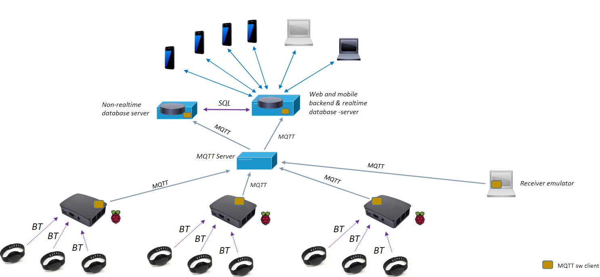
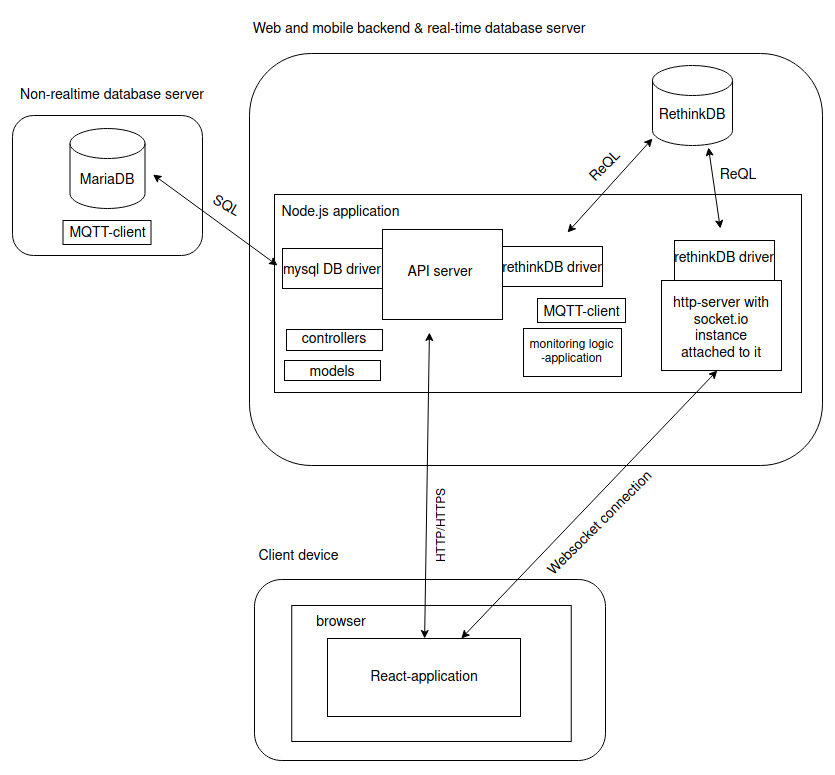
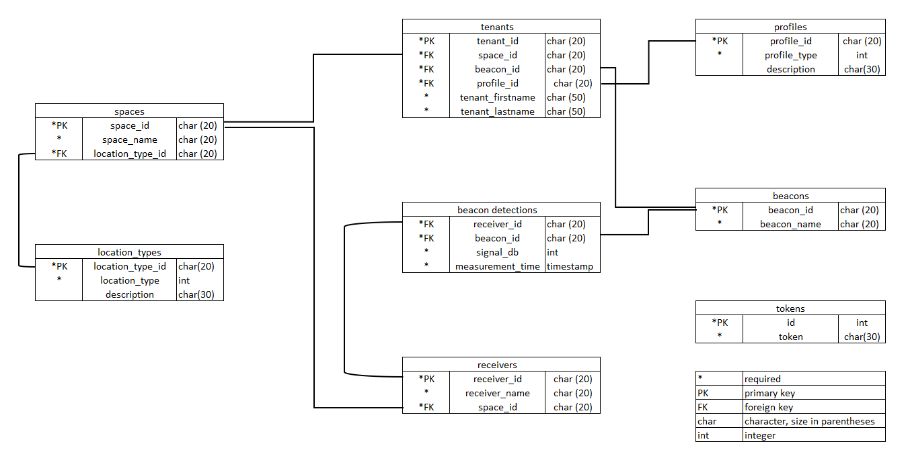
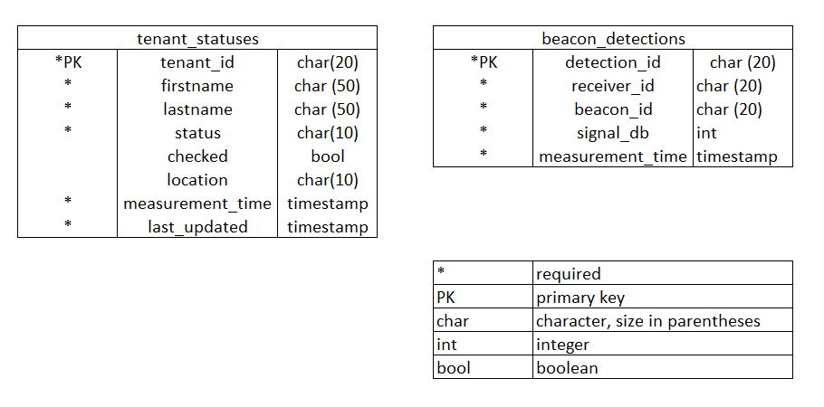
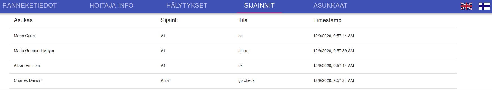

<!-- TABLE OF CONTENTS -->
# Project Bluetooth Beacons
## Table of Contents
* [Introduction](#introduction)
* [Architecture and Technical Description](#architecture-and-technical-description)
  * [The Description of the API](#the-description-of-the-api)
* [The Database systems](#the-database-systems)
  * [Non-realtime Database (MariaDB)](#non-realtime-database-(mariadb))
  * [Realtime Database (RethinkDB)](#real-time-database-(rethinkdb))
* [Installation](#installation)
  * [Development environment](#development-environment)
  * [Production environment](#production-environment)
* [Webclient](#Webclient)
* [Known issues and future developments](#Known-issues-and-future-developments)
* [License](#License)

<!-- INTRODUCTION -->
# Introduction

The purpose of this project is to help nursing staff in a new nursing home (that will be completed in the near future) to monitor their patients who are suffering from memory disorders. Picture 1 represents the areas in the new nursing facility. The patients are allowed to walk freely in the premises, but if they reach an area where they shouldn't be, they need to be guided back to the allowed space. One of the ways this project accomplishes that is by tracking the patients via a bluetooth wristlet that they wear. This wristlet is tracked by Raspberry Pis installed inside the nursing facility. The system is programmed to allow the patients freedom of movement inside the areas they are permitted to access. However, the system will send an alarm if a patient leaves the designated areas. The areas that are allowed to the patients depend on their profile (free to move, restricted to one's own home, now allowed to visit others quarters etc.). The nurses can see where the patients move via a mobile application and a desktop application, and they can check out the alarms.

The system's backend server is built with Node.js + Express framework and the front end client is made with React framework. The mobile application is built with Expo platform for universal React applications. The system has two databases: a non-realtime database using MariaDB database system and a real-time database using RethinkDB database system.


Picture 1. This picture is a model of the new nursing home that will be built in the near future.

<!-- Architecture -->
# Architecture and Technical Description

Picture 2 shows the monitoring system. The Raspberry Pis in different locations send MQTT data of the beacon wristlets to the MQTT server. The backend server listens to this data from the MQTT server, determines the locations of the patients according to this data, and notifies the changes in realtime to the mobile and desktop clients. The non-realtime database is used to get information of the tenants, locations, profiles etc.


Picture 2. The system architecture.

The system is built with these technologies:
* [MariaDB](https://mariadb.org/)
* [RethinkDB](https://rethinkdb.com/)
* [Socket.io](https://socket.io/)
* [React](https://reactjs.org/)
* [Expo/React Native](https://docs.expo.io/)
* [Node.js](https://nodejs.org/en/)
* [MQTT](http://mqtt.org/)

MariaDB database holds information related to the nursing home, its tenants and the monitoring system equipments. The MQTT data stored in this database is meant for future Big Data analysis. The RethinkDB database is used for its ability to push updated query results with changefeeds to other applications in realtime. This reduces the need for polling changes, and with the help of socket.io library that establishes a WebSocket communication channel between the client and the server, the changes in tenant locations and statuses are sent in realtime to the client. The front-end client in the browser is built with React. The mobile client uses the Expo-platform and its managed workflow for React Native, and the repository of the mobile version is linked [here](https://github.com/Vanhusmonitorointiprojekti/Bluetooth_beacons_mobile).

The backend servers use the Express framework for Node.js. The MQTT client listens to the MQTT data transmission of the MQTT server, and writes data to the realtime database (RethinDB). The MQTT data the MQTT server sends and the monitoring system consumes is in the following format
(receiver-name mac-address-of-the-beacon signal-strengt):
```
receiver2 ff:ff:ff:ff:ff:ff -37
```

Another MQTT client writes MQTT data to the non-realtime database (MariaDB) The API server gets the MQTT data from realtime database and checks the locations of each beacon in the interval of 6 seconds by calculating the average signal strenght of the three latest detection measurements per beacon and determines the closest receiver for all the beacons. After this, the server checks if it's alright for the tenant holding the beacon wristlet to be in the location where the receiver is, and updates the tenant's status to the realtime database. If the tenant is not allowed in the area, the server sends a push notification to the mobile phone of the nurse. The server also updates the tenant statuses and locations to the realtime database. These changes are sent via a socket.io connection from the http-server with socket.io-instance attached to it to client applications. 

In the mobile application the nurse can check the alarm, and if the tenant's alarm state is checked, the server will not send new notifications. When the tenant returns to the allowed space, the server determines that the alarm situtation is over and returns the tenant's state to unchecked. If the tenant moves again to the restricted area, there will be a new notification.  

Picture 3 shows the main components and connections of the system in the production environment. The difference to the development environment is that both databases are located on the same server. The mobile system is depicted [here](https://github.com/Vanhusmonitorointiprojekti/Bluetooth_beacons_mobile).


Picture 3. The main components and connections.

## The Description of the API

> Method | Url | Action
> ------ | ------ | ------
> GET | /tenants | Gets all the tenants
> GET | /receivers | Gets all the receivers
> GET | /detections | Gets all the MQTT detections
> GET | /detections/locations | Gets the current locations of the beacons
> DELETE | /detections | Deletes all the MQTT detections
> GET | /statuses | Gets the current tenant statuses
> GET | /statuses/:id | Gets the status of a tenant with id
> POST | /statuses | Adds a tenant with status info
> PUT | /statuses/:id | Updates the record of a tenant with id
> POST | /api/push_notification/push_token | Adds a new token
> POST | /api/push_notification/message | Adds a message and sends it as a push notification


# The Database Systems
## Non-realtime Database (MariaDB)
The non-realtime database uses the [MariaDB](https://mariadb.org/) database system and is used for holding information about the patients (tenants), beacons, receivers and other details related to these. Picture 4 shows the non-realtime database model.


Picture 4. The non-realtime database.

> ### _location_types_
> _The location_types table contains the location types of the spaces in the facility._
> 
> Field | Type | Description
> ------ | ------ | ------
> location_type_id | char(20) PK | The id of the location type
> location_type | int |  The type of the location as a number
> description | char(30) | The description of the location type (home, lounge, lobby etc.)

> ### _spaces_
> _The spaces table contains the spaces in the facility._
> 
> Field | Type | Description
> ------ | ------ | ------
> space_id | char(20) PK | The id of the location type
> space_name | char(20) |  The name of the space
> location_type_id | char(20) FK | The location type of the space, reference to the [location_types](#location_types) table

> ### _receivers_
> _The receivers table contains the receivers in the facility._
> 
> Field | Type | Description
> ------ | ------ | ------
> receiver_id | char(20) PK | The id of the receiver
> receiver_name | char(20) |  The name of the receiver
> space_id | char(20) FK | The space where the receiver is, reference to the [spaces](#spaces) table

> ### _beacons_
> _The beacons table contains the beacons of the tenants (patients to be monitored)._
> 
> Field | Type | Description
> ------ | ------ | ------
> beacon_id | char(20) PK | The id of the beacon
> beacon_name | char(20) |  The name of the beacon

> ### _profiles_
> _The profiles table contains the profiles of the tenants._
> 
> Field | Type | Description
> ------ | ------ | ------
> profile_id | char(20) PK | The id of the profile
> profile_type | int |  The type of the profile as a number
> description | char(30) | The description of the profile

> ### _beacon_detections_
> _The beacon_detections table contains the MQTT data received from the MQTT server._
> 
> Field | Type | Description
> ------ | ------ | ------
> receiver_id | char(20) FK | The id of the receiver, reference to the [receivers](#receivers) table
> beacon_id | char(20) FK |  The id of the beacon, reference to the [beacons](#beacons) table
> signal_db | int | The strength of the measurement signal in decibels
> measurement_time | timestamp | The timestamp of the measurement

> ### _tenants_
> _The tenants table contains the tenants of the nursing home._
> 
> Field | Type | Description
> ------ | ------ | ------
> tenant_id | char(20) PK | The id of the tenant
> space_id | char(20) FK |  The space where the tenant lives, reference to the [spaces](#spaces) table
> beacon_id | char(20) FK |  The beacon (wristlet) of the tenant, reference to the [beacons](#beacons) table
> profile_id | char(20) FK |  The profile of the tenant, reference to the [profiles](#profiles) table
> tenant_firstname | char(50) | The first name of the tenant
> tenant_lastname | char(50) | The last name of the tenant

> ### _tokens_
> _The tokens table contains the Expo tokens needed for sending push notifications to the mobile phones of the nurses._
> 
> Field | Type | Description
> ------ | ------ | ------
> id | int PK | The id of the token
> token | char(30) |  The Expo token of the mobile phone

## Realtime Database (RethinkDB)
The real-time database uses the [RethinkDB](https://rethinkdb.com/) database system and is used for the location information and detection data. The detection data on this database is deleted on regular intervals, where as the detection data stored in MariaDB non-realtime database is preserved. Picture 5 shows the real-time database model.



Picture 5. The real-time database.

> ### _beacon_detections_
> _The beacon_detections table contains the MQTT data received from the MQTT server._
> 
> Field | Type | Description
> ------ | ------ | ------
> detection_id | char(20) PK | The id of the detection measurement
> receiver_id | char(20) FK | The receiver of the measurement
> beacon_id | char(20) FK |  The beacon of the measurement
> signal_db | int | The strength of the measurement signal in decibels
> measurement_time | timestamp | The timestamp of the measurement

> ### _tenant_statuses_
> _The tenants table contains the tenants of the nursing home._
> 
> Field | Type | Description
> ------ | ------ | ------
> tenant_id | char(20) PK | The id of the tenant
> firstname | char(50) | The first name of the tenant
> lastname | char(50) | The last name of the tenant
> status | char(10) | The monitoring status of the tenant (ok, go check, alarm)
> checked | bool | The boolean value, if the tenant's alarm is checked or not
> location | char(10) | The space where the tenant currently is
> measurement_time | timestamp | The timestamp of the measurement
> last_updated | timestamp | The timestamp when the tenant status was updated


<!-- INSTALLATION -->
## Installation

### Development environment

Load and install 
 [Visual Studio Code](https://code.visualstudio.com/download), [Node](https://nodejs.org/en/download/), [Git](https://git-scm.com/downloads), [RethinkDB](https://rethinkdb.com/docs/install/) and [MariaDB](https://mariadb.com/downloads/).

 The schema.sql file for the non-realtime MariaDB database can be found in the folder src/non_realtime_db. After installation of MariaDB you should create a user with root privileges and password-based access:
```
sudo mariadb
GRANT ALL ON *.* TO 'admin'@'localhost' IDENTIFIED BY 'admin_password' WITH GRANT OPTION;
FLUSH PRIVILEGES;
exit
```
After this, you can log in to mariaDB as admin with password:
```
mysql -u admin -p
```
For the project, create these users to the MariaDB database:
```
GRANT ALL ON senior_monitoring.* TO 'nrt_user'@'%' IDENTIFIED BY 'nrt_user_password'
CREATE USER 'mqtt_client' IDENTIFIED BY 'mqtt_client_password';
GRANT USAGE ON *.* TO 'mqtt_client'@'%' IDENTIFIED BY 'mqtt_client_password';
GRANT ALL PRIVILEGES ON senior_monitoring.* TO 'mqtt_client'@'%';
FLUSH PRIVILEGES;
exit
```

After installing RethinkDB you can start the rethinkDB server from a terminal window with the command
```
rethinkdb
```
This will create a rethinkdb_data folder. When the server is running, you can use the administrative UI by opening your browser and going to localhost:8080. Instructions to create the realtime database for RethinDB are found in the file rethindb.txt in the folder src/realtimd_db. A quick introduction for how to use the RethinkDB can be found [here](https://rethinkdb.com/docs/quickstart/).

You will need to add two users for the realtime database:
```
r.db('rethinkdb').table('users').insert({id: 'rt_user', password: 'rt_user_password'})
r.db('rethinkdb').table('users').insert({id: 'mqtt_user', password: 'mqtt_user_password'})
r.db('rt_beacons').table('beacon_detections').grant('mqtt_user', {write: true});
r.db('rt_beacons').grant('rt_user', {read: true, write: true, config: false});
```

For the application to work, you will need to add this .env file to the root of the project included with your database passwords (and server IP:s):

```
RDB_HOST=
RDB_DB=rt_beacons
RDB_PORT=28105

NRT_HOST=
NRT_USER=nrt_user
NRT_PASSWORD=

MQTT_USER=mqtt_user
MQTT_PASSWORD=

RT_USER=rt_user
RT_PASSWORD=
```

 - Clone the project: 
```
 git clone https://github.com/Vanhusmonitorointiprojekti/Bluetooth_beacons.git
 cd Bluetooth_beacons
 ```
 - Install the dependencies: 
  ```
 npm install
 ```
 - Start RethinkDB server in another terminal window (in the folder where you created the rethinkdb_data folder)
 ```
 rethinkdb
 ```
 - Start the monitoring server:
 ```
cd src/realtime_db
node monitorserver.js
```
 - Start the React-application in another terminal with this command (in the project's root): 
  ```sh
 npm start
```
- in your browser, go to [http://localhost:3000](http://localhost:3000) to see the React application
### Production environment

During this project the backend and databases were installed on Ubuntu 20.04 servers following the aforementioned instructions and [this guide](https://www.digitalocean.com/community/tutorials/how-to-set-up-a-node-js-application-for-production-on-ubuntu-20-04). 

A free domain name was acquired via [Freenom](https://www.freenom.com/). [Nginx](https://www.nginx.com/) was used as a reverse-proxy server for the backend application and configured with SSL with [Let's Encrypt certificate obtained with Certbot](https://letsencrypt.org/). [PM2 daemon process manager](https://pm2.keymetrics.io/) was used for making the node applications run as services in the background. 

The MariaDB non-realtime database system was running on another server (private IP), whereas the Node.js backend and RethinkDB realtime database system were running on another server (public IP). For the MariaDB in the non-realtime server, define the nrt_user accordingly:
```
CREATE USER 'nrt_user' IDENTIFIED BY 'nrt_user_password';
GRANT USAGE ON *.* TO 'nrt_user'@'%' IDENTIFIED BY 'nrt_user_password';
GRANT SELECT ON senior_monitoring.* TO 'nrt_user'@'%';
```
You will also need to configure MariaDB to [allow remote connections](https://mariadb.com/kb/en/configuring-mariadb-for-remote-client-access/).

A couple of tweaks were made in the backend code. The src/realtime_db/rt_mqtt_client was started as separate node processes managed by PM2 (and not inside the monitorserver.js file, for instance). Clearing the detections from the database was handled as a separate service as well, and not in the src/realtime_db_monitor_tenants.js file. 

Mobile version of the app can be found here: https://github.com/Vanhusmonitorointiprojekti/Bluetooth_beacons_mobile

<!-- Webclient  -->
## Webclient

Sijainnit (Locations) -page contains information about the locations and statuses of the tenants:


Other pages were hardcoded examples of beacon, nurse, alarm and tenant information pages and how they could look like in the future.


<!-- Known issues and future developments -->
## Known issues and future developments

- nurses can login into system
- nurses can choose the tenants whose alarms and status they observe
- a night profile needs to be added, where all the tenants are restricted to their own home during the night time
- more steps for checking the alarms need to be added in addition to the "Situation ok" ("I'll go check", "Escalate to others")
- if a beacon is not detected within a certain time limit, send an alarm
- if the alarm is not checked by a nurse within a certain time limit, escalate to others automatically
- the system should send a warning, if a tenant is not chosen for monitoring
- improve the administrative panel (the webclient)
- the backend monitor app crashes if an unknown receiver is found in the MQTT data, this needs to be fixed

<!-- License -->
## License
Licensed under MIT -license.
https://opensource.org/licenses/MIT

